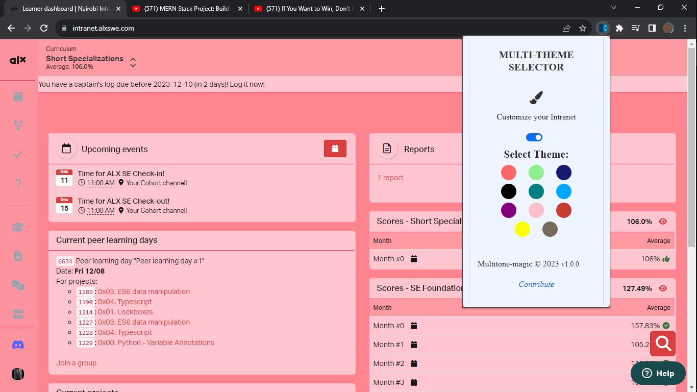
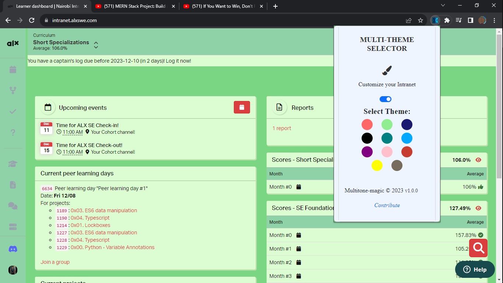
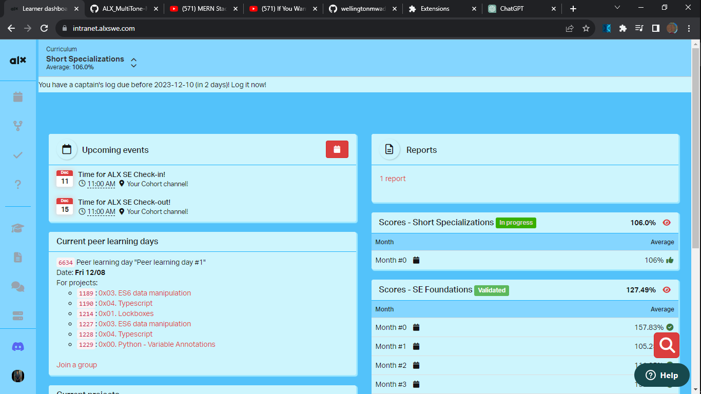
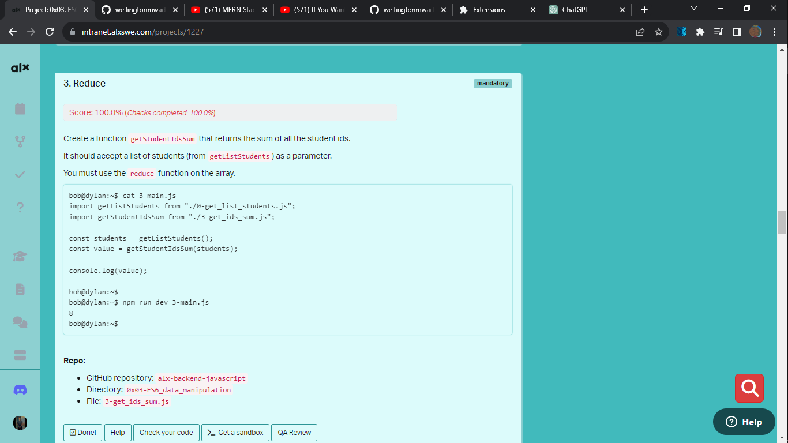
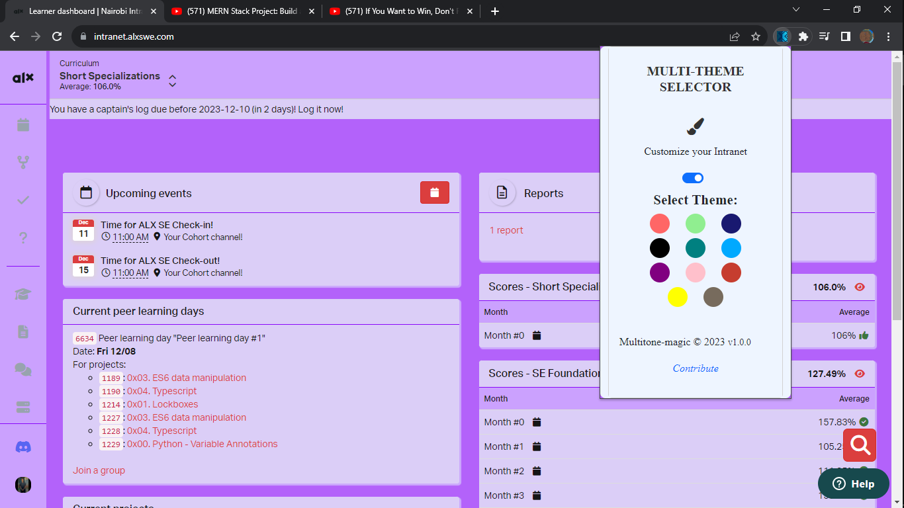
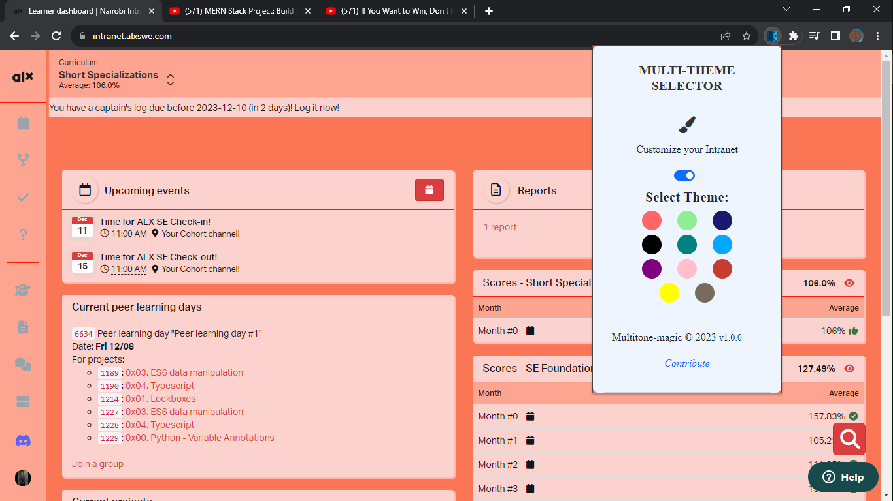
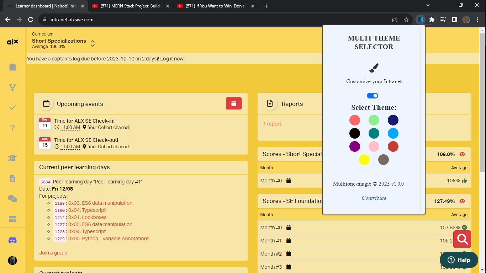
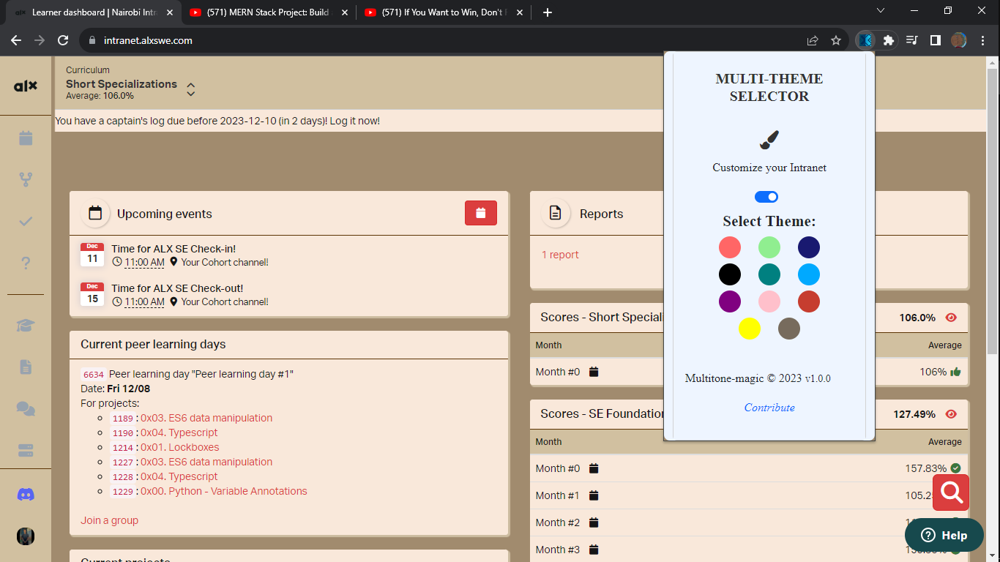

---

# Multi-Theme Selector Extension Documentation

## Overview

The Multi-Theme Selector extension allows users to customize the theme of the ALX Intranet by choosing from a variety of color themes that is  `pink`, `green`, `navy-blue`, `black`, `teal`, `ocean-blue`, `purple`, `pink`, `orange`, `yellow` and `grey`.


### 🌟 The Marvel of Themes 🌟
"Pink" - Embrace Your Inner Barbie!
Let the shades of pink immerse you in a world of elegance and joy, reminiscent of your childhood fantasies!



"Green" - Feel the Earth's Serenity!
Connect with nature through lush green hues that evoke the tranquility of forests and meadows!



"Ocean" - Dive into Oceanic Depths!
Experience the refreshing blues of the ocean, taking you on a calming journey amidst the waves!



"Black" - Sleek and Elegant!
The timeless black theme adds a touch of sophistication and modernity to your browsing!


"Teal" - Enchanting and Sophisticated!
The blend of blue and green brings forth a sophisticated yet vibrant aura.



"Purple" - Indulge in Royal Elegance!
Elevate your browsing experience with rich purples that evoke a sense of regal refinement!



"Orange" - Radiate Positivity!
Bask in the warmth and radiance of vibrant oranges, sparking energy and enthusiasm!




"Yellow" - Embrace Sunshine and Happiness!
Let the brilliance of yellow brighten your day, bringing in joy and positivity!



"Grey" - Chic and Minimalistic!
For those who prefer a sleek and minimalist vibe, grey offers understated elegance!



## 🚀 Installation Process 🚀


1. Visit the [Chrome Web Store](https://chrome.google.com/webstore/category/extensions) and search for "Multi-Theme Selector."

2. Click on the "Add to Chrome" button to install the extension.

3. Once installed, the extension icon will appear in the browser toolbar.

4. Click pin in your list of extensions to pin browser toolbar.

## Features

### Theme Selection

- Click on the extension icon in the toolbar to open the theme selector.
- Toggle the switch to enable or disable the extension.
- Choose a theme by clicking on the color circles.


### Persistence

- The selected theme is saved and persists even after reloading the page or reopening the browser.

### Contribution

### **Steps**

1. [Fork](https://github.com/wellingtonmwadali/ALX_MultiTone-Magic/fork/) this project
2. [Clone](git clone https://github.com/wellingtonmwadali/ALX_MultiTone-Magic.git) your forked version
3. Make changes
4. Create a [branch](https://docs.github.com/en/pull-requests/collaborating-with-pull-requests/proposing-changes-to-your-work-with-pull-requests/about-branches#working-with-branches)
5. [Commit](https://help.github.com/articles/adding-a-file-to-a-repository-using-the-command-line/) your changes (write a short descriptive message of what you have done)
6. [Push](https://help.github.com/articles/pushing-to-a-remote/) your changes to your forked version
7. Go to the original project on GitHub & Create a [Pull Request](https://help.github.com/articles/about-pull-requests/)


- Contribute to the development of the extension on [GitHub](https://github.com/wellingtonmwadali/ALX_MultiTone-Magic/).

## DONE 🥳


### Watch the Video

[](https://www.example.com/feature-video.mp4)

## Usage

1. **Open Theme Selector:**
   - Click on the extension icon in the toolbar.
   - Toggle the switch to enable/disable the extension.

2. **Select a Theme:**
   - Click on one of the color circles to apply the selected theme.

3. **Persistence:**
   - The selected theme persists across page reloads and browser restarts.

## Customization

### Adding More Themes

1.Define your theme (e.g  `custom-theme`) in your branch.

2.Add your theme circle in the popup-styles.css file.

    ```css
    /* popup-styles.css */
    .theme-custom {
        /* Add your theme color-code */
    }
    ```

3. Edit your theme in the Theme/theme.css file.

    ```css
    .body-custom-theme .#element {
        /* element's styles*/
    }
    ```

4. Create a pull request from your branch.

### Modifying Themes
Feel free to add or modify the content to better resonate with yourself: 
- To modify existing themes,create a branch and edit the corresponding CSS themes (e.g., `theme-grey.`, `theme-light-green.css`) in the theme.css file inside the Theme folder.
- Then create a pull request on your branch.

## Troubleshooting

- If you encounter any issues or have questions, check the [FAQ section](#faq) or reach out to either [Mwadali](mailto:wellingtonmwadali.com) or [Alex](mailto:lexizgichbuoy@gmail.com)

## FAQ

### Q: How do I reset the theme to the default?

A: Toggle the switch off, and the extension will reset to the default theme.

### Q: Why is my custom theme not applying?

A: Ensure that your classes are defined as expected i.e should start with `body .theme-{colorname}`.

### Q: Why are others theme not applying?

A: Reload the page after you select your theme.

B: Toggle the switch off and chose your theme.

---
